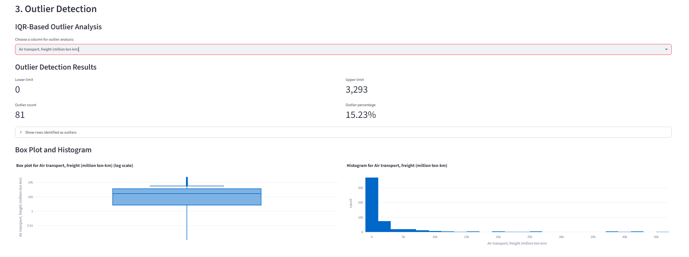
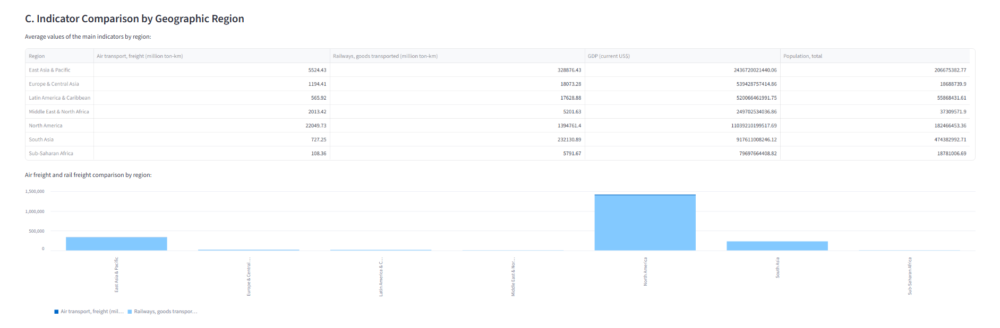
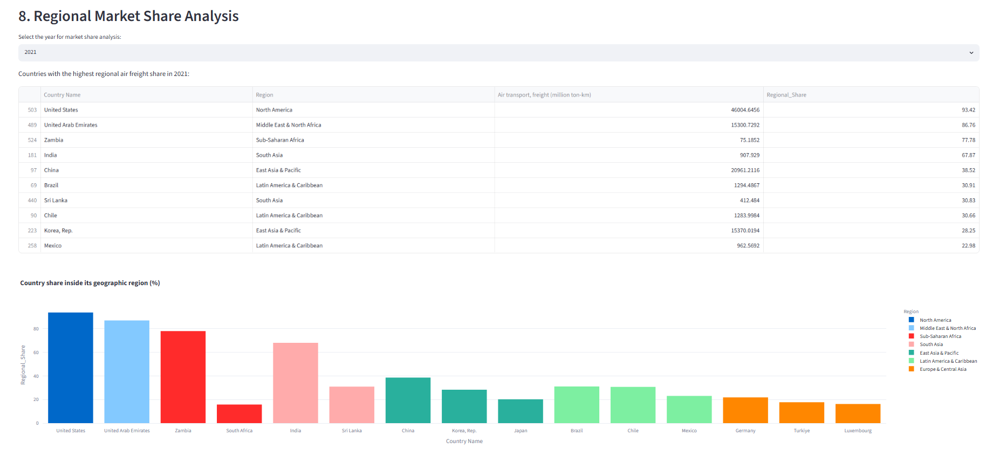
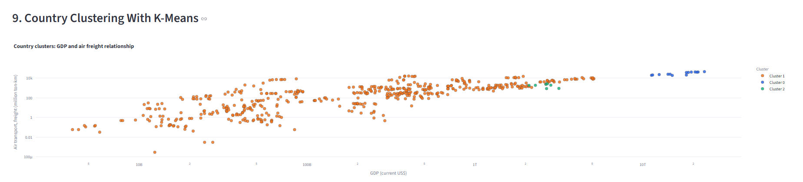
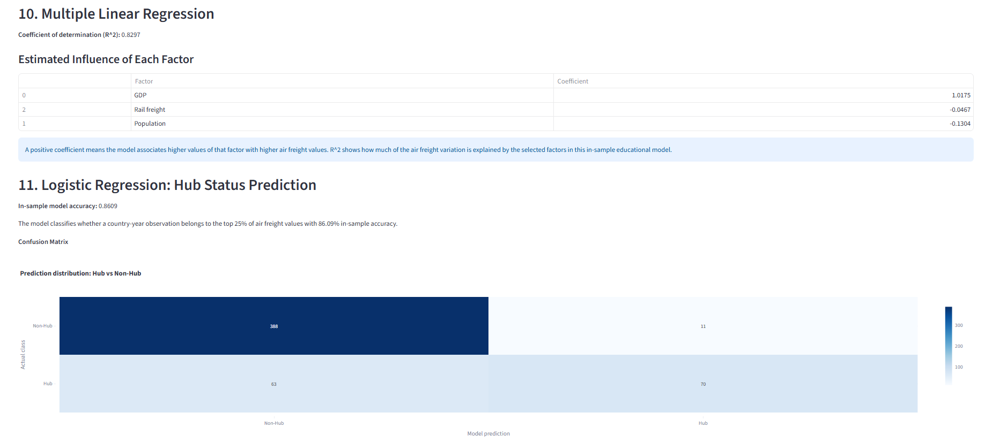

# Global Freight Transport Analytics

Global Freight Transport Analytics is a Streamlit dashboard for exploring how air freight relates to rail freight, GDP, population, region, and income group across countries.

The project was originally developed as a university data science assignment and then refactored into a portfolio-ready version. It focuses on transparent preprocessing, interactive exploratory analysis, and introductory machine learning models that make the dataset easier to inspect and discuss.

## What It Does

- Cleans a World Bank-style transport dataset and reshapes it from wide format into an analysis-ready table.
- Merges country-level metadata such as geographic region and income group.
- Shows missing values and applies grouped forward fill, backward fill, and median imputation for freight indicators.
- Detects outliers with the IQR method and visualizes them with box plots and histograms.
- Encodes categorical variables with one-hot encoding or label encoding.
- Scales numerical features with `StandardScaler` or `MinMaxScaler`.
- Aggregates freight, GDP, and population indicators by year and geographic region.
- Filters and sorts countries by air freight volume.
- Computes regional air freight market share by country and year.
- Clusters country-year observations with K-Means.
- Uses multiple linear regression to estimate how GDP, population, and rail freight relate to air freight.
- Uses logistic regression to classify whether a country-year observation belongs to the top 25% of air freight values.

## Tech Stack

- Python 3.11+
- Streamlit for the interactive dashboard
- pandas and NumPy for data preparation
- Plotly for interactive visualizations
- scikit-learn for preprocessing, clustering, and regression models

## Screenshots

### Outlier Detection



### Regional Indicator Comparison



### Regional Market Share



### K-Means Country Clustering



### Model Results



## Project Structure

```text
.
|-- app.py                         # Streamlit analytics dashboard
|-- docs/
|   `-- screenshots/               # Dashboard screenshots used in the README
|-- prepare_data.py                # Data cleaning and reshaping pipeline
|-- raw_transport_data.csv         # Original World Bank-style export
|-- processed_transport_data.csv   # Analysis-ready dataset used by the app
|-- country_metadata.csv           # Country region and income metadata
|-- requirements.txt               # Python dependencies
`-- README.md
```

## Data Pipeline

`prepare_data.py` reads `raw_transport_data.csv`, keeps the original export unchanged, and creates `processed_transport_data.csv`.

The preprocessing flow is:

1. Remove unused metadata columns.
2. Drop trailing rows that do not contain valid series or country names.
3. Replace World Bank missing-value markers (`..`) with `NaN`.
4. Convert year columns to numeric values.
5. Reshape the data from wide format to long format.
6. Pivot indicator names into individual columns.
7. Merge region and income group metadata from `country_metadata.csv`.

The resulting dataset contains country-year observations for air freight, rail freight, GDP, population, region, and income group.

## Local Setup

Create and activate a virtual environment:

```bash
python -m venv .venv
source .venv/bin/activate
```

On Windows PowerShell:

```powershell
python -m venv .venv
.\.venv\Scripts\Activate.ps1
```

Install dependencies:

```bash
pip install -r requirements.txt
```

Run the preprocessing script if you want to regenerate the processed dataset:

```bash
python prepare_data.py
```

Start the Streamlit app:

```bash
streamlit run app.py
```

## Machine Learning Notes

The machine learning sections are designed for exploration and interpretation, not production forecasting.

- K-Means groups country-year observations using air freight, rail freight, GDP, and population.
- Multiple linear regression estimates relationships between scaled indicators and air freight.
- Logistic regression classifies whether an observation is in the top 25% of air freight values.
- Reported regression and classification metrics are in-sample because the dashboard is an educational analysis tool.

For a production-grade predictive model, the next step would be to add train/test splits, cross-validation, model comparison, and stricter feature engineering.

## Portfolio Summary

This project demonstrates an end-to-end data analytics workflow: raw data preparation, missing-value handling, exploratory data analysis, interactive visualization, feature preprocessing, clustering, and basic supervised learning in a Streamlit application.
